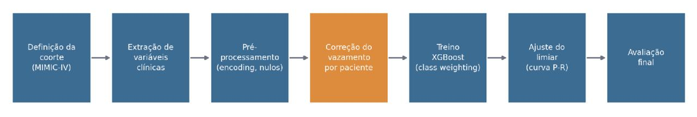
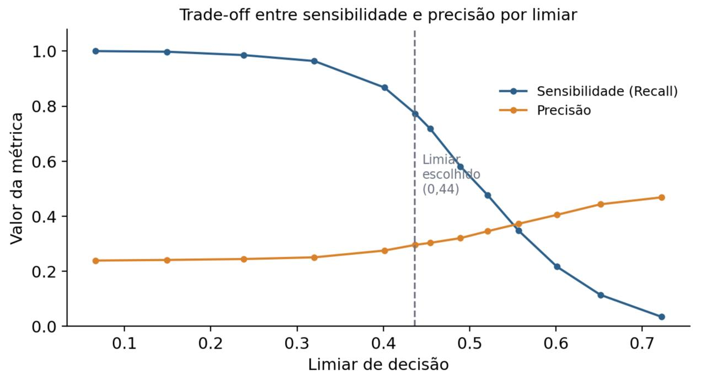
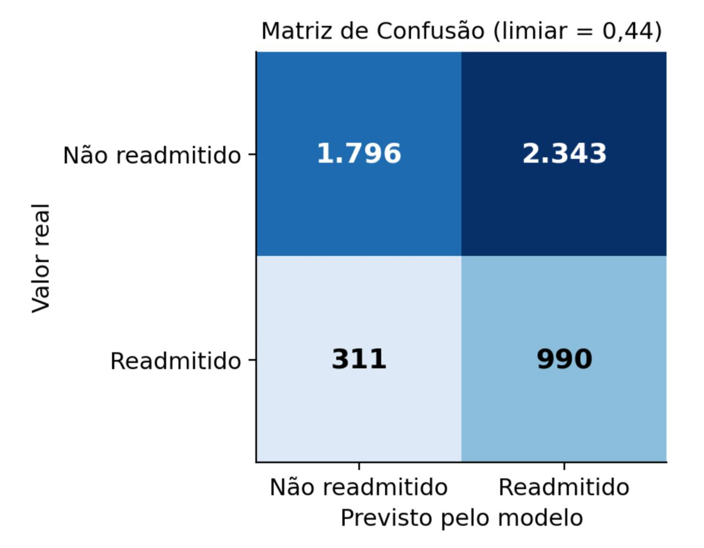
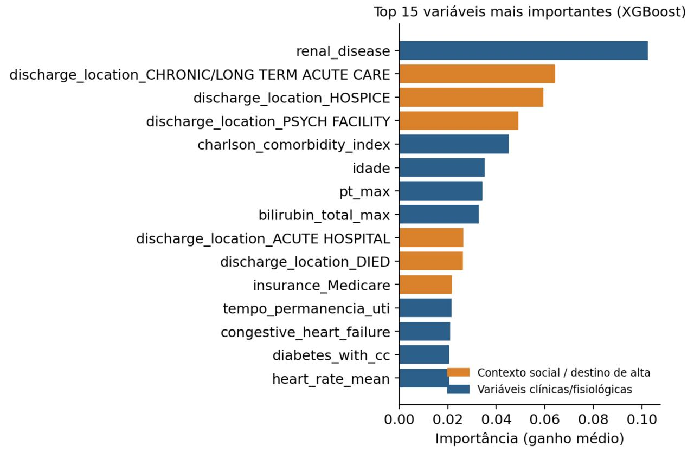

# Predição de Readmissão Hospitalar em 30 Dias — MIMIC-IV

Modelo preditivo para estimar o risco de readmissão hospitalar em até 30 dias
em pacientes adultos de UTI, usando a base pública **MIMIC-IV**.

> 📄 Este projeto também foi apresentado como resumo expandido no **XI SAPCT —
> SENAI CIMATEC (2026)**.

## Problema

A readmissão hospitalar em até 30 dias após a alta é um indicador relevante
de qualidade assistencial, associado ao aumento de custos e à sobrecarga dos
sistemas de saúde. Identificar precocemente pacientes com maior risco permite
intervenções mais direcionadas na transição de cuidado.

## Pipeline



1. Definição da coorte (pacientes de UTI, sobreviventes, refinado para sepse)
2. Extração de variáveis clínicas via Google BigQuery (sinais vitais, exames
   laboratoriais, comorbidades — Índice de Charlson)
3. Pré-processamento (encoding, tratamento de nulos)
4. **Correção de vazamento de dados por paciente** (ver seção abaixo)
5. Treino com XGBoost e ponderação de classes
6. Ajuste do limiar de decisão via curva precisão-recall
7. Avaliação final

## Achado metodológico: vazamento de dados por paciente

Durante o desenvolvimento, identificou-se que uma divisão treino/teste
"ingênua" (por linha) permitia que o **mesmo paciente** aparecesse em ambos os
conjuntos — já que um paciente pode ter múltiplas internações registradas na
base. Isso inflava artificialmente as métricas de avaliação.

- **28,1%** dos pacientes do conjunto de teste também estavam presentes no treino
- Corrigido com `GroupShuffleSplit` (agrupamento por `subject_id`)
- Após a correção, o AUC se manteve estável (0,64 → 0,64), confirmando que o
  modelo captura sinal real, não um artefato do erro metodológico

Esse processo de diagnóstico e correção está documentado em
[`notebooks/`](./notebooks) e é discutido em detalhe no relatório técnico
anexo.

## Resultados

| Métrica | Valor |
|---|---|
| AUC-ROC | 0,6404 |
| Sensibilidade (recall) | 76,1% |
| Especificidade | 43,4% |
| Precisão | 29,7% |

O limiar de decisão foi calibrado para priorizar sensibilidade — clinicamente,
deixar de identificar um paciente que será readmitido (falso negativo) é mais
grave do que um alarme falso.




### Importância das variáveis



Variáveis de **contexto social e transição de cuidado** (destino na alta,
tipo de cobertura de saúde) figuram entre as mais importantes, ao lado de
comorbidades clínicas — reforçando que a readmissão hospitalar é um fenômeno
multifatorial, não plenamente explicado por variáveis fisiológicas isoladas.

## Limitações conhecidas

- AUC de 0,64 indica capacidade discriminativa moderada, ainda distante do
  desempenho desejável para aplicação clínica direta (tipicamente ≥ 0,75)
- Agregação de sinais vitais por média perde informação temporal
- Imputação de nulos pela mediana do dataset completo (antes do split) introduz
  um pequeno vazamento de informação — aceito como simplificação conhecida
- Coorte refinada para sepse reduz tamanho amostral em favor de maior
  homogeneidade clínica

## Trabalhos futuros

- Modelagem de séries temporais em vez de agregação por média
- Otimização de hiperparâmetros (GridSearch/RandomizedSearch)
- Migração do pipeline para AWS SageMaker, visando escalabilidade e MLOps

## Dados

Este projeto usa a base pública [MIMIC-IV](https://physionet.org/content/mimiciv/),
acessada mediante certificação em ética em pesquisa e credenciamento na
plataforma PhysioNet. **Os dados brutos não estão incluídos neste repositório**
em conformidade com o Data Use Agreement do PhysioNet — apenas código e
resultados agregados.

## Estrutura do repositório

```
├── notebooks/          # Notebooks de exploração, treino e diagnóstico de vazamento
├── figuras/             # Figuras geradas para o relatório
├── relatorio/           # Resumo expandido (SAPCT) e relatório técnico final
└── README.md
```

## Referências

- JOHNSON, A. E. W. et al. MIMIC-IV, a freely accessible electronic health
  record dataset. *Scientific Data*, v. 10, 2023.
- Resumo expandido completo e relatório técnico disponíveis na pasta
  [`relatorio/`](./relatorio).
